##### Import library

    ## Warning: package 'MASS' was built under R version 3.2.4

    ## Warning: package 'effects' was built under R version 3.2.4

    ## Warning: package 'vcd' was built under R version 3.2.4

    ## Warning: package 'mlogit' was built under R version 3.2.4

    ## Warning: package 'maxLik' was built under R version 3.2.4

    ## Warning: package 'miscTools' was built under R version 3.2.4

    ## Warning: package 'nnet' was built under R version 3.2.4

    ## Warning: package 'data.table' was built under R version 3.2.4

    ## Warning: package 'lattice' was built under R version 3.2.4

##### Convert excel data file into .csv format. Read all data from csv file in R.

##### Rename 24 data attributes according to codebook provided.

##### (Detected some discrepency and several missing attributes such as self-reported health status)

##### Compute Mental Health Score:

-   Read self-assessment scores of q201-q290, 90 questions from Symptom
    Checklist-90-Revised.
-   Each question carries 1-5 marks, representing none, mild, moderate,
    severe, extreme.
-   Sum up 90 scores

##### Compute Drinking Behaviour Score

-   3 question
-   Frequency of drinking
-   How many drinks containing alcohol do you have on a typical day when
    you are drinking?
-   How often do you have six or more drinks on one occasion?
-   Each question carries 1-5 marks, representing degree of alcohol
    consumption
-   Sum up 3 scores

##### Further process data (mainly Categorization)

-   Education Attainment
-   4 catrgories: Elementary or lower, Junior high school, High school,
    College or above
-   Gender
-   swap sequence into 2 categories: Male, Female
-   Number of Accompanying Children
-   3 categories: No children, Cohabitating children, Children residing
    elsewhere
-   Salary
-   4 categories: \<1500RMB, 1500-2500RMB, 2500-3500RMB, \>=3500RMB
-   Number of Cities Resided in
-   2 categories: 1-2, \>=3
-   Daily Working Hours
-   Weekly Working Days
-   BMI:
-   BMI = weight(kg) / (height(m)^2)
-   3 categories: \< 18.5; \>= 18.5 and \< 24; \>=24
-   Mental Health
-   2 categories: if MentalHealth score \<= 160, Normal; if MentalHealth
    score \> 160, Abnormal
-   Smoking
-   Current Smoker
-   2 categories: Unhealthy, Healthy
-   if smoked in the past 30 days, Unhealthy; else Healthy
-   Drinking
-   Hazardous Alcohol Consumption
-   2 categories: Unhealthy, Healthy
-   if Alcohol Consumption Score \>=4 for Male or Alcohol Consumption
    Score \>=3 for Female, Unhealthy; else Healthy
-   Daily Sleeping Hours
-   2 categories: Unhealthy, Healthy
-   if Daily Sleeping Hours 7-9 hours/night, Health; else Unhealthy
-   Sleeping Quality
-   2 categories: 1-2 Good/Fair; 3-4 Poor/Very Poor
-   Daily Breakfasts
-   2 categories: Unhealthy, Healthy
-   if almost Daily Breakfasts, Health; else Unhealthy
-   Daily Fruits and Vegetables Consumption
-   2 categories: Unhealthy, Healthy
-   if almost Daily Fruits and Vegetables Consumption, Health; else
    Unhealthy
-   Daily Regular Meals
-   2 categories: Unhealthy, Healthy
-   if almost Daily Regular Meals, Health; else Unhealthy

##### Compute Lifestyle Behaviour Score

-   6 factors: CurrentSmoker, HazardousDrink, DailySleepingHours,
    DailyBreakfast, DailyFruitsVegetables, DailyRegularMeals
-   1 score for every Unhealthy Behavior
-   Sum: 0, Healthy; 1-2 Relatively Healthy; 3-6 Unhealthy

##### Till here, end of Section 0 - Data Preparation

##### Section 1 - Chi-square Test for Socio-demographic characteristics of Rural-to-Urban Migrants by Gender

    ##       GenderX
    ## AgeX   Male Female
    ##   <=32 1237   1408
    ##   >32  1574   1265

    ## 
    ##  Pearson's Chi-squared test
    ## 
    ## data:  Age
    ## X-squared = 41.241, df = 1, p-value = 1.346e-10

    ##                     GenderX
    ## Occupation           Male Female
    ##   Manufacturing      1406   1107
    ##   Construction        677     92
    ##   Hospitality         148    237
    ##   Domestic service    144    430
    ##   Small business      232    403
    ##   Recreation/leisure  204    404

    ## 
    ##  Pearson's Chi-squared test
    ## 
    ## data:  Occupation
    ## X-squared = 752.52, df = 5, p-value < 2.2e-16

    ##               GenderX
    ## WorkplaceScale Male Female
    ##       Large     851    649
    ##       Moderate 1101    841
    ##       Small     859   1183

    ## 
    ##  Pearson's Chi-squared test
    ## 
    ## data:  WorkplaceScale
    ## X-squared = 110.02, df = 2, p-value < 2.2e-16

    ##                      GenderX
    ## EducationAttainmentX  Male Female
    ##   Elementary or lower   53    110
    ##   Junior high school   340    501
    ##   High school         1409   1380
    ##   College             1009    682

    ## 
    ##  Pearson's Chi-squared test
    ## 
    ## data:  EducationAttainment
    ## X-squared = 110.89, df = 3, p-value < 2.2e-16

    ##                      GenderX
    ## MaritalStatus         Male Female
    ##   Married             2042   1977
    ##   Single               700    631
    ##   Cohabitating          39     47
    ##   Divorced or widowed   30     18

    ## 
    ##  Pearson's Chi-squared test
    ## 
    ## data:  MaritalStatus
    ## X-squared = 4.9029, df = 3, p-value = 0.179

    ##                              GenderX
    ## AccompanyChildX               Male Female
    ##   No children                  849    796
    ##   Cohabitating children        878    968
    ##   Children residing elsewhere 1084    909

    ## 
    ##  Pearson's Chi-squared test
    ## 
    ## data:  AccompanyChild
    ## X-squared = 18, df = 2, p-value = 0.0001234

    ##               GenderX
    ## SalaryX        Male Female
    ##   <1500RMB      168    317
    ##   1500-2500RMB 1036   1492
    ##   2500-3500RMB 1071    628
    ##   >=3500RMB     536    236

    ## 
    ##  Pearson's Chi-squared test
    ## 
    ## data:  Salary
    ## X-squared = 356.87, df = 3, p-value < 2.2e-16

    ##                         GenderX
    ## NumberOfCitiesResidedInX Male Female
    ##                      1-2 1859   2207
    ##                      >=3  952    466

    ## 
    ##  Pearson's Chi-squared test
    ## 
    ## data:  NumberOfCitiesResidedIn
    ## X-squared = 193, df = 1, p-value < 2.2e-16

    ##                   GenderX
    ## DailyWorkingHoursX Male Female
    ##               =8   1273   1310
    ##               <8     18     62
    ##               8-11 1066    615
    ##               >=11  454    686

    ## 
    ##  Pearson's Chi-squared test
    ## 
    ## data:  DailyWorkingHours
    ## X-squared = 189.59, df = 3, p-value < 2.2e-16

    ##                   GenderX
    ## WeeklyWorkingDaysX Male Female
    ##                <=4   57     99
    ##                5    805    759
    ##                6   1046   1201
    ##                7    903    614

    ## 
    ##  Pearson's Chi-squared test
    ## 
    ## data:  WeeklyWorkingDays
    ## X-squared = 74.984, df = 3, p-value = 3.652e-16

    ##                        GenderX
    ## TypeOfResidence         Male Female
    ##   Collective dormitory  1040    515
    ##   Renting with others    324    312
    ##   Renting as a family    897   1400
    ##   Renting alone          430    324
    ##   Owning a living place  120    122

    ## 
    ##  Pearson's Chi-squared test
    ## 
    ## data:  TypeOfResidence
    ## X-squared = 299.26, df = 4, p-value < 2.2e-16

##### Section 2 - Chi-square Test for Physical and Mental Status and Lifestyle Behaviours of Rural-to-Urban Migrants by Gender

    ##                     GenderX
    ## BMIX                 Male Female
    ##   Under Weight        108    238
    ##   Normal             1785   1883
    ##   Overweight/Obesity  918    552

    ## 
    ##  Pearson's Chi-squared test
    ## 
    ## data:  BMI
    ## X-squared = 139.2, df = 2, p-value < 2.2e-16

    ##              GenderX
    ## MentalHealthX Male Female
    ##      Normal   2508   2378
    ##      Abnormal  303    295

    ## 
    ##  Pearson's Chi-squared test
    ## 
    ## data:  MentalHealth
    ## X-squared = 0.093297, df = 1, p-value = 0.76

    ##                               GenderX
    ## CurrentSmokerX                 Male Female
    ##   Previous smoker/Never smoked 1489   2611
    ##   Current smoker               1322     62

    ## 
    ##  Pearson's Chi-squared test
    ## 
    ## data:  Smoking
    ## X-squared = 1451.6, df = 1, p-value < 2.2e-16

    ##                           GenderX
    ## HazardousDrinkX            Male Female
    ##   Nonhazardous alcohol use 1980   2458
    ##   Hazardous alcohol use     831    215

    ## 
    ##  Pearson's Chi-squared test
    ## 
    ## data:  Drinking
    ## X-squared = 411.04, df = 1, p-value < 2.2e-16

    ##                       GenderX
    ## DailySleepingHoursX    Male Female
    ##   7-9 Hours/night      2165   2105
    ##   <7 or >9 Hours/night  646    568

    ## 
    ##  Pearson's Chi-squared test
    ## 
    ## data:  SleepingTime
    ## X-squared = 2.3835, df = 1, p-value = 0.1226

    ##                           GenderX
    ## SleepingQualityX           Male Female
    ##   Nonhazardous alcohol use 2474   2341
    ##   Hazardous alcohol use     337    332

    ## 
    ##  Pearson's Chi-squared test
    ## 
    ## data:  SleepingQuality
    ## X-squared = 0.2386, df = 1, p-value = 0.6252

    ##                             GenderX
    ## DailyBreakfastX              Male Female
    ##   Almost Daily Breakfast     2302   2156
    ##   Not Almost Daily Breakfast  509    517

    ## 
    ##  Pearson's Chi-squared test
    ## 
    ## data:  DailyBreakfast
    ## X-squared = 1.3721, df = 1, p-value = 0.2414

    ##                                     GenderX
    ## DailyFruitsVegetablesX               Male Female
    ##   Almost Daily Fruits Vegetables     2101   2149
    ##   Not Almost Daily Fruits Vegetables  710    524

    ## 
    ##  Pearson's Chi-squared test
    ## 
    ## data:  DailyFruitsVegetables
    ## X-squared = 25.121, df = 1, p-value = 5.384e-07

    ##                                  GenderX
    ## DailyRegularMealsX                Male Female
    ##   Almost Daily Regular Meals      2398   2244
    ##   Not Almost Daily Regular Meals   413    429

    ## 
    ##  Pearson's Chi-squared test
    ## 
    ## data:  DailyRegularMeals
    ## X-squared = 1.9416, df = 1, p-value = 0.1635

    ##                     GenderX
    ## ScoreX               Male Female
    ##   Healthy             640   1385
    ##   Relatively Healthy 1544   1001
    ##   Unhealthy           627    287

    ## 
    ##  Pearson's Chi-squared test
    ## 
    ## data:  LifestyleScoreX
    ## X-squared = 513.27, df = 2, p-value < 2.2e-16

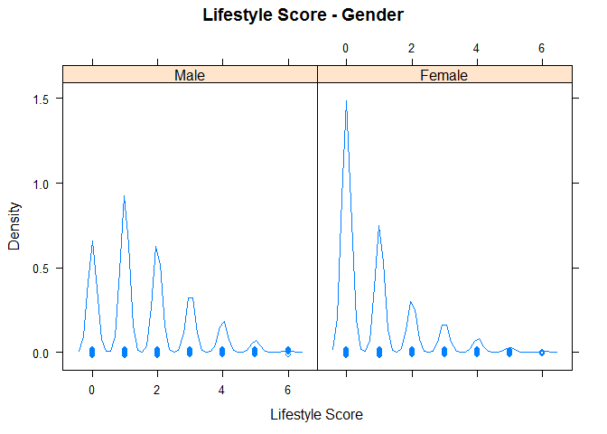<!-- -->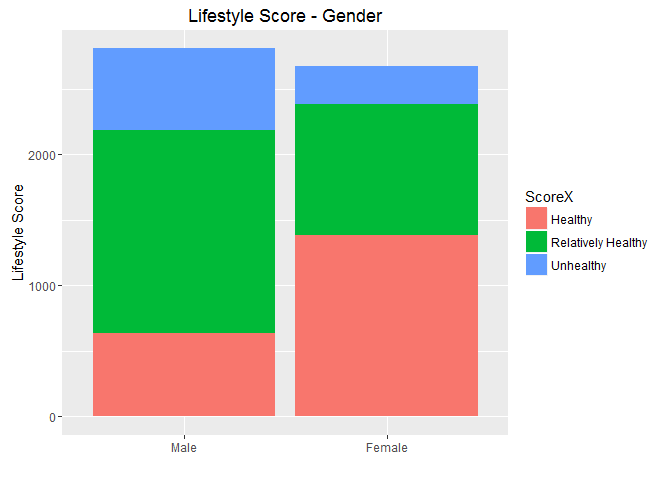<!-- -->

##### Section 3 - Association between lifestyle Score and socio-demographic characteristics and phiscal and mental status (By Gender)

-   3.1.1 For Male rural-to-urban migrants (All 13 independent variables
    available are used in the logistic regression model)

<!-- -->

    ## 
    ## Call:
    ## glm(formula = ScoreX ~ AGE1 + OCCUPATION1 + WORKPLACESCALE1 + 
    ##     EDUCATIONATTAINMENT1 + MARITALSTATUS1 + ACCOMPANYCHILD1 + 
    ##     SALARY1 + NUMBEROFCITIESRESIDEDIN1 + DAILYWORKINGHOURS1 + 
    ##     WEEKLYWORKINGDAYS1 + RESIDENCE1 + BMI1 + MENTALHEALTH1, data = Male)
    ## 
    ## Deviance Residuals: 
    ##      Min        1Q    Median        3Q       Max  
    ## -1.49797  -0.35625   0.05648   0.25285   1.32332  
    ## 
    ## Coefficients:
    ##                                 Estimate Std. Error t value Pr(>|t|)    
    ## (Intercept)                     1.978631   0.156230  12.665  < 2e-16 ***
    ## AGE1>32                         0.081273   0.029291   2.775  0.00556 ** 
    ## OCCUPATION1Construction         0.063100   0.039560   1.595  0.11081    
    ## OCCUPATION1Hospitality          0.154353   0.059876   2.578  0.00999 ** 
    ## OCCUPATION1DomesticSservices   -0.044610   0.058487  -0.763  0.44568    
    ## OCCUPATION1SmallBusiness        0.075734   0.049764   1.522  0.12816    
    ## OCCUPATION1Recreation/Leisures  0.331250   0.053911   6.144 9.18e-10 ***
    ## WORKPLACESCALE1Moderate        -0.008106   0.032049  -0.253  0.80034    
    ## WORKPLACESCALE1Small            0.115419   0.035588   3.243  0.00120 ** 
    ## EDUCATIONATTAINMENT1JuniorHigh -0.187499   0.095858  -1.956  0.05056 .  
    ## EDUCATIONATTAINMENT1HighSchool -0.111268   0.091229  -1.220  0.22270    
    ## EDUCATIONATTAINMENT1College    -0.072839   0.093310  -0.781  0.43509    
    ## MARITALSTATUS1Single            0.056723   0.050426   1.125  0.26074    
    ## MARITALSTATUS1Cohabitating      0.120444   0.111791   1.077  0.28140    
    ## MARITALSTATUS1Divorced/Widowed  0.100772   0.119414   0.844  0.39880    
    ## ACCOMPANYCHILD1Cohabitate      -0.008547   0.051075  -0.167  0.86712    
    ## ACCOMPANYCHILD1ResideElsewhere  0.007660   0.049181   0.156  0.87624    
    ## SALARY11500-2500RMB             0.027921   0.054442   0.513  0.60809    
    ## SALARY12500-3500RMB             0.058638   0.054596   1.074  0.28290    
    ## SALARY1>=3500RMB                0.117109   0.059141   1.980  0.04778 *  
    ## NUMBEROFCITIESRESIDEDIN1>=3    -0.004453   0.026825  -0.166  0.86817    
    ## DAILYWORKINGHOURS1<8           -0.025527   0.154696  -0.165  0.86894    
    ## DAILYWORKINGHOURS18-11          0.003987   0.030943   0.129  0.89748    
    ## DAILYWORKINGHOURS1>=11          0.114165   0.039478   2.892  0.00386 ** 
    ## WEEKLYWORKINGDAYS15            -0.163331   0.090661  -1.802  0.07172 .  
    ## WEEKLYWORKINGDAYS16            -0.048697   0.088735  -0.549  0.58320    
    ## WEEKLYWORKINGDAYS17            -0.115942   0.089946  -1.289  0.19750    
    ## RESIDENCE1Rent(with others)     0.006436   0.042956   0.150  0.88091    
    ## RESIDENCE1Rent(family)          0.023618   0.034763   0.679  0.49695    
    ## RESIDENCE1Rent(alone)           0.095617   0.039563   2.417  0.01572 *  
    ## RESIDENCE1OwnLivingPlace       -0.096656   0.067424  -1.434  0.15181    
    ## BMI1NormalWeight               -0.049859   0.065055  -0.766  0.44350    
    ## BMI1Overweight                 -0.066137   0.067823  -0.975  0.32958    
    ## MENTALHEALTH1Abnormal           0.358392   0.039948   8.972  < 2e-16 ***
    ## ---
    ## Signif. codes:  0 '***' 0.001 '**' 0.01 '*' 0.05 '.' 0.1 ' ' 1
    ## 
    ## (Dispersion parameter for gaussian family taken to be 0.4152092)
    ## 
    ##     Null deviance: 1266.9  on 2810  degrees of freedom
    ## Residual deviance: 1153.0  on 2777  degrees of freedom
    ## AIC: 5542.3
    ## 
    ## Number of Fisher Scoring iterations: 2

-   3.1.2 For Male rural-to-urban migrants (Only 4 significant
    independent variables (5% significance level) are used in the
    logistic regression model)

<!-- -->

    ## 
    ## Call:
    ## glm(formula = ScoreX ~ OCCUPATION1 + WORKPLACESCALE1 + DAILYWORKINGHOURS1 + 
    ##     MENTALHEALTH1, data = Male)
    ## 
    ## Deviance Residuals: 
    ##      Min        1Q    Median        3Q       Max  
    ## -1.46151  -0.34635   0.08104   0.17163   1.22839  
    ## 
    ## Coefficients:
    ##                                Estimate Std. Error t value Pr(>|t|)    
    ## (Intercept)                     1.84107    0.02624  70.153  < 2e-16 ***
    ## OCCUPATION1Construction         0.06123    0.03448   1.776 0.075896 .  
    ## OCCUPATION1Hospitality          0.18906    0.05901   3.204 0.001372 ** 
    ## OCCUPATION1DomesticSservices   -0.05676    0.05794  -0.980 0.327284    
    ## OCCUPATION1SmallBusiness        0.06123    0.04808   1.273 0.203018    
    ## OCCUPATION1Recreation/Leisures  0.37062    0.05210   7.113 1.43e-12 ***
    ## WORKPLACESCALE1Moderate        -0.01269    0.03148  -0.403 0.686744    
    ## WORKPLACESCALE1Small            0.11243    0.03536   3.179 0.001492 ** 
    ## DAILYWORKINGHOURS1<8           -0.02754    0.15480  -0.178 0.858829    
    ## DAILYWORKINGHOURS18-11          0.02224    0.02879   0.772 0.439925    
    ## DAILYWORKINGHOURS1>=11          0.13740    0.03614   3.801 0.000147 ***
    ## MENTALHEALTH1Abnormal           0.37791    0.03959   9.545  < 2e-16 ***
    ## ---
    ## Signif. codes:  0 '***' 0.001 '**' 0.01 '*' 0.05 '.' 0.1 ' ' 1
    ## 
    ## (Dispersion parameter for gaussian family taken to be 0.4193105)
    ## 
    ##     Null deviance: 1266.9  on 2810  degrees of freedom
    ## Residual deviance: 1173.6  on 2799  degrees of freedom
    ## AIC: 5548.1
    ## 
    ## Number of Fisher Scoring iterations: 2

    ##                                      COR     2.5 %   97.5 %
    ## (Intercept)                    6.3032581 5.9872399 6.635956
    ## OCCUPATION1Construction        1.0631474 0.9936648 1.137489
    ## OCCUPATION1Hospitality         1.2081163 1.0761608 1.356252
    ## OCCUPATION1DomesticSservices   0.9448161 0.8433954 1.058433
    ## OCCUPATION1SmallBusiness       1.0631395 0.9675210 1.168208
    ## OCCUPATION1Recreation/Leisures 1.4486360 1.3080062 1.604386
    ## WORKPLACESCALE1Moderate        0.9873853 0.9283122 1.050217
    ## WORKPLACESCALE1Small           1.1189892 1.0440630 1.199292
    ## DAILYWORKINGHOURS1<8           0.9728401 0.7182534 1.317666
    ## DAILYWORKINGHOURS18-11         1.0224851 0.9663920 1.081834
    ## DAILYWORKINGHOURS1>=11         1.1472823 1.0688223 1.231502
    ## MENTALHEALTH1Abnormal          1.4592257 1.3502784 1.576964

###### Male - significant risk factor COR visualization

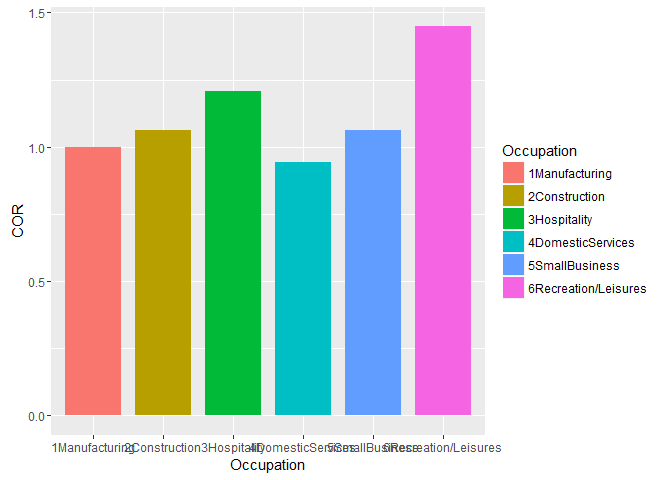<!-- -->

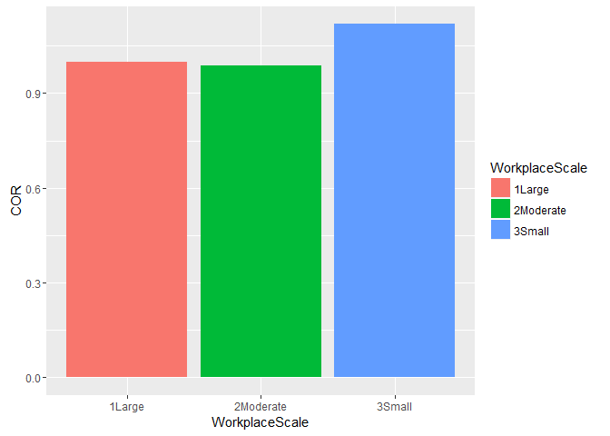<!-- -->

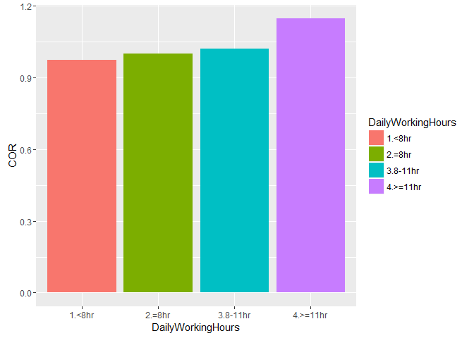<!-- -->

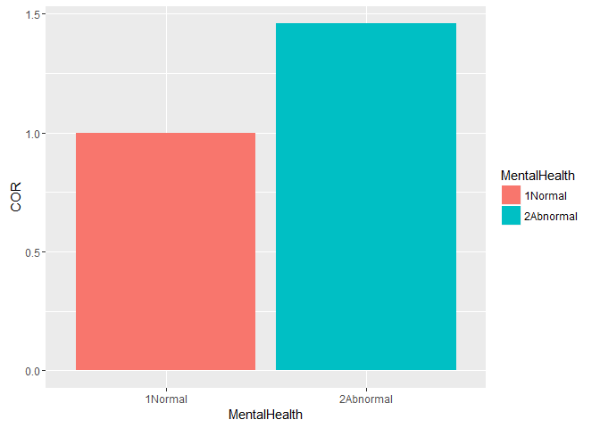<!-- -->

-   3.2.1 For Female rural-to-urban migrants (All 13 independent
    variables available are used in the logistic regression model)

<!-- -->

    ## 
    ## Call:
    ## glm(formula = ScoreX ~ AGE2 + OCCUPATION2 + WORKPLACESCALE2 + 
    ##     EDUCATIONATTAINMENT2 + MARITALSTATUS2 + ACCOMPANYCHILD2 + 
    ##     SALARY2 + NUMBEROFCITIESRESIDEDIN2 + DAILYWORKINGHOURS2 + 
    ##     WEEKLYWORKINGDAYS2 + RESIDENCE2 + BMI2 + MENTALHEALTH2, data = Female)
    ## 
    ## Deviance Residuals: 
    ##     Min       1Q   Median       3Q      Max  
    ## -1.6138  -0.4594  -0.2414   0.5136   1.7972  
    ## 
    ## Coefficients:
    ##                                 Estimate Std. Error t value Pr(>|t|)    
    ## (Intercept)                     1.293523   0.120644  10.722  < 2e-16 ***
    ## AGE2>32                         0.014917   0.029424   0.507 0.612224    
    ## OCCUPATION2Construction        -0.021491   0.073038  -0.294 0.768600    
    ## OCCUPATION2Hospitality          0.147091   0.047071   3.125 0.001798 ** 
    ## OCCUPATION2DomesticSservices    0.108534   0.039136   2.773 0.005589 ** 
    ## OCCUPATION2SmallBusiness        0.098447   0.043174   2.280 0.022675 *  
    ## OCCUPATION2Recreation/Leisures  0.517682   0.045688  11.331  < 2e-16 ***
    ## WORKPLACESCALE2Moderate         0.010667   0.035235   0.303 0.762112    
    ## WORKPLACESCALE2Small            0.051326   0.034373   1.493 0.135499    
    ## EDUCATIONATTAINMENT2JuniorHigh  0.039865   0.064800   0.615 0.538470    
    ## EDUCATIONATTAINMENT2HighSchool  0.020335   0.062973   0.323 0.746785    
    ## EDUCATIONATTAINMENT2College     0.018209   0.067369   0.270 0.786959    
    ## MARITALSTATUS2Single            0.193591   0.050926   3.801 0.000147 ***
    ## MARITALSTATUS2Cohabitating      0.100922   0.098914   1.020 0.307682    
    ## MARITALSTATUS2Divorced/Widowed  0.106013   0.145290   0.730 0.465661    
    ## ACCOMPANYCHILD2Cohabitate      -0.012255   0.050199  -0.244 0.807148    
    ## ACCOMPANYCHILD2ResideElsewhere -0.035067   0.048845  -0.718 0.472871    
    ## SALARY21500-2500RMB            -0.084068   0.038723  -2.171 0.030019 *  
    ## SALARY22500-3500RMB            -0.072600   0.044031  -1.649 0.099298 .  
    ## SALARY2>=3500RMB                0.143917   0.057656   2.496 0.012616 *  
    ## NUMBEROFCITIESRESIDEDIN2>=3     0.085318   0.031630   2.697 0.007033 ** 
    ## DAILYWORKINGHOURS2<8            0.045368   0.080913   0.561 0.575049    
    ## DAILYWORKINGHOURS28-11          0.075581   0.032102   2.354 0.018625 *  
    ## DAILYWORKINGHOURS2>=11          0.049497   0.034045   1.454 0.146106    
    ## WEEKLYWORKINGDAYS25            -0.032612   0.071192  -0.458 0.646931    
    ## WEEKLYWORKINGDAYS26             0.004615   0.068104   0.068 0.945979    
    ## WEEKLYWORKINGDAYS27             0.042469   0.068022   0.624 0.532455    
    ## RESIDENCE2Rent(with others)     0.070459   0.047383   1.487 0.137129    
    ## RESIDENCE2Rent(family)         -0.012636   0.036423  -0.347 0.728682    
    ## RESIDENCE2Rent(alone)           0.097644   0.045539   2.144 0.032110 *  
    ## RESIDENCE2OwnLivingPlace       -0.114915   0.067504  -1.702 0.088810 .  
    ## BMI2NormalWeight                0.053338   0.043179   1.235 0.216841    
    ## BMI2Overweight                  0.033017   0.050794   0.650 0.515736    
    ## MENTALHEALTH2Abnormal           0.320589   0.038185   8.396  < 2e-16 ***
    ## ---
    ## Signif. codes:  0 '***' 0.001 '**' 0.01 '*' 0.05 '.' 0.1 ' ' 1
    ## 
    ## (Dispersion parameter for gaussian family taken to be 0.367857)
    ## 
    ##     Null deviance: 1220.97  on 2672  degrees of freedom
    ## Residual deviance:  970.77  on 2639  degrees of freedom
    ## AIC: 4948.3
    ## 
    ## Number of Fisher Scoring iterations: 2

-   3.2.2 For Female rural-to-urban migrants (Only 6 significant
    independent variables (5% significance level) are used in the
    logistic regression model)

<!-- -->

    ## 
    ## Call:
    ## glm(formula = ScoreX ~ OCCUPATION2 + MARITALSTATUS2 + SALARY2 + 
    ##     NUMBEROFCITIESRESIDEDIN2 + DAILYWORKINGHOURS2 + MENTALHEALTH2, 
    ##     data = Female)
    ## 
    ## Deviance Residuals: 
    ##     Min       1Q   Median       3Q      Max  
    ## -1.5727  -0.4732  -0.2671   0.5141   1.7329  
    ## 
    ## Coefficients:
    ##                                Estimate Std. Error t value Pr(>|t|)    
    ## (Intercept)                     1.34070    0.03957  33.884  < 2e-16 ***
    ## OCCUPATION2Construction        -0.00888    0.06721  -0.132 0.894905    
    ## OCCUPATION2Hospitality          0.17127    0.04435   3.862 0.000115 ***
    ## OCCUPATION2DomesticSservices    0.14341    0.03586   3.999 6.52e-05 ***
    ## OCCUPATION2SmallBusiness        0.13067    0.03729   3.505 0.000465 ***
    ## OCCUPATION2Recreation/Leisures  0.56922    0.04093  13.907  < 2e-16 ***
    ## MARITALSTATUS2Single            0.22566    0.03074   7.340 2.83e-13 ***
    ## MARITALSTATUS2Cohabitating      0.14767    0.09303   1.587 0.112571    
    ## MARITALSTATUS2Divorced/Widowed  0.12666    0.14461   0.876 0.381165    
    ## SALARY21500-2500RMB            -0.07364    0.03820  -1.927 0.054031 .  
    ## SALARY22500-3500RMB            -0.06479    0.04292  -1.510 0.131281    
    ## SALARY2>=3500RMB                0.15020    0.05579   2.692 0.007139 ** 
    ## NUMBEROFCITIESRESIDEDIN2>=3     0.08220    0.03143   2.615 0.008968 ** 
    ## DAILYWORKINGHOURS2<8            0.07469    0.08009   0.933 0.351107    
    ## DAILYWORKINGHOURS28-11          0.09773    0.03044   3.211 0.001339 ** 
    ## DAILYWORKINGHOURS2>=11          0.06661    0.03059   2.177 0.029532 *  
    ## MENTALHEALTH2Abnormal           0.32200    0.03810   8.451  < 2e-16 ***
    ## ---
    ## Signif. codes:  0 '***' 0.001 '**' 0.01 '*' 0.05 '.' 0.1 ' ' 1
    ## 
    ## (Dispersion parameter for gaussian family taken to be 0.3690315)
    ## 
    ##     Null deviance: 1220.97  on 2672  degrees of freedom
    ## Residual deviance:  980.15  on 2656  degrees of freedom
    ## AIC: 4939.9
    ## 
    ## Number of Fisher Scoring iterations: 2

    ##                                      COR     2.5 %   97.5 %
    ## (Intercept)                    3.8217307 3.5365553 4.129902
    ## OCCUPATION2Construction        0.9911594 0.8688213 1.130724
    ## OCCUPATION2Hospitality         1.1868136 1.0880065 1.294594
    ## OCCUPATION2DomesticSservices   1.1542077 1.0758718 1.238247
    ## OCCUPATION2SmallBusiness       1.1395947 1.0592826 1.225996
    ## OCCUPATION2Recreation/Leisures 1.7668876 1.6306798 1.914473
    ## MARITALSTATUS2Single           1.2531444 1.1798628 1.330978
    ## MARITALSTATUS2Cohabitating     1.1591268 0.9659214 1.390977
    ## MARITALSTATUS2Divorced/Widowed 1.1350338 0.8549043 1.506954
    ## SALARY21500-2500RMB            0.9290095 0.8619871 1.001243
    ## SALARY22500-3500RMB            0.9372682 0.8616527 1.019519
    ## SALARY2>=3500RMB               1.1620696 1.0417058 1.296341
    ## NUMBEROFCITIESRESIDEDIN2>=3    1.0856702 1.0208079 1.154654
    ## DAILYWORKINGHOURS2<8           1.0775489 0.9210168 1.260685
    ## DAILYWORKINGHOURS28-11         1.1026676 1.0388085 1.170452
    ## DAILYWORKINGHOURS2>=11         1.0688807 1.0066763 1.134929
    ## MENTALHEALTH2Abnormal          1.3798815 1.2805854 1.486877

###### Female - significant risk factor COR visualization

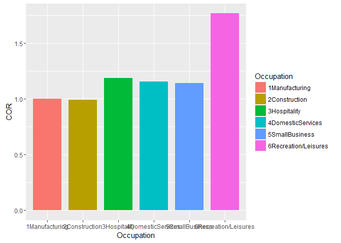<!-- -->

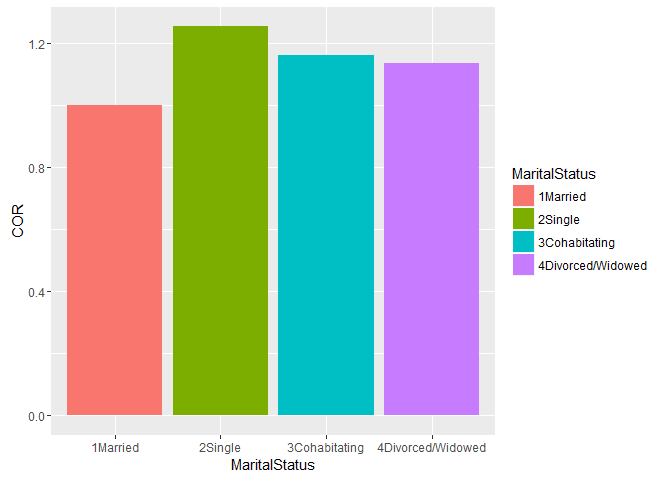<!-- -->

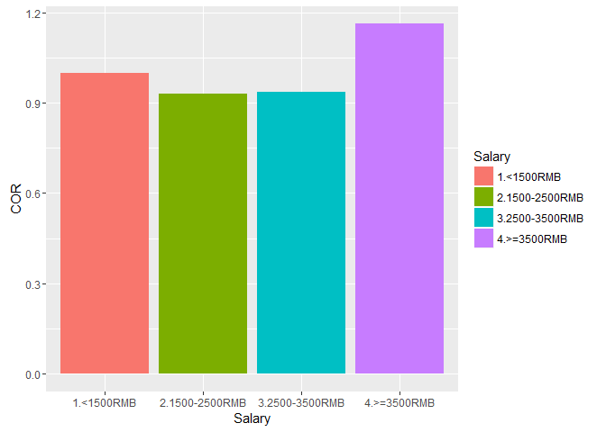<!-- -->

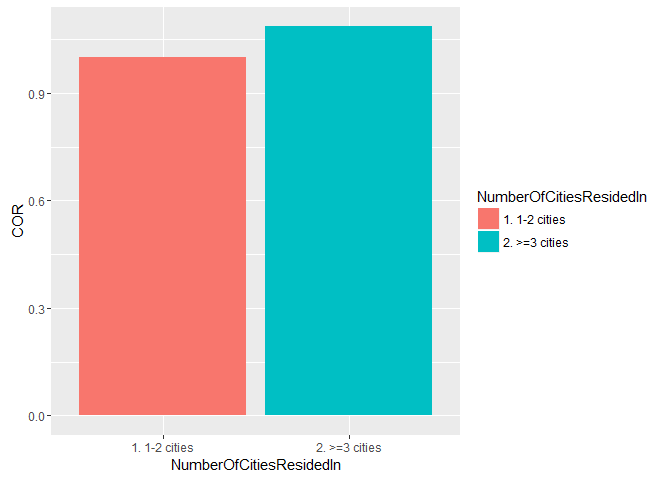<!-- -->

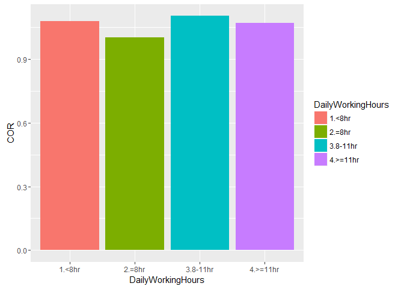<!-- -->

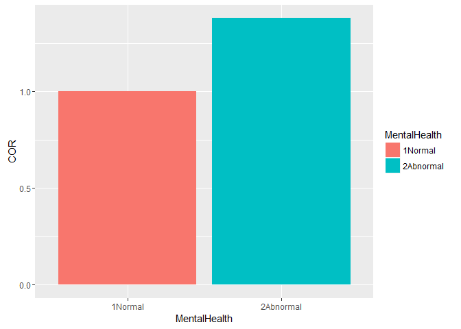<!-- -->
