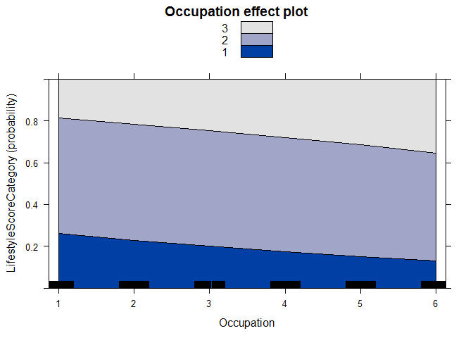

    ## Warning: package 'MASS' was built under R version 3.2.4

    ## Warning: package 'effects' was built under R version 3.2.4

    ## Warning: package 'vcd' was built under R version 3.2.4

    ## Warning: package 'mlogit' was built under R version 3.2.4

    ## Warning: package 'maxLik' was built under R version 3.2.4

    ## Warning: package 'miscTools' was built under R version 3.2.4

    ## Warning: package 'nnet' was built under R version 3.2.4

    ##       Gender
    ## Age    Male Female
    ##   <=32 1237   1408
    ##   >32  1574   1265

    ## 
    ##  Pearson's Chi-squared test
    ## 
    ## data:  Age
    ## X-squared = 41.241, df = 1, p-value = 1.346e-10

    ##                     Gender
    ## Occupation           Male Female
    ##   Manufacturing      1406   1107
    ##   Construction        677     92
    ##   Hospitality         148    237
    ##   Domestic service    144    430
    ##   Small business      232    403
    ##   Recreation/leisure  204    404

    ## 
    ##  Pearson's Chi-squared test
    ## 
    ## data:  Occupation
    ## X-squared = 752.52, df = 5, p-value < 2.2e-16

    ##               Gender
    ## WorkplaceScale Male Female
    ##       Large     851    649
    ##       Moderate 1101    841
    ##       Small     859   1183

    ## 
    ##  Pearson's Chi-squared test
    ## 
    ## data:  WorkplaceScale
    ## X-squared = 110.02, df = 2, p-value < 2.2e-16

    ##                      Gender
    ## EducationalAttainment Male Female
    ##   Elementary or lower  393    611
    ##   Junior high school  1409   1380
    ##   High school          777    543
    ##   College              232    139

    ## 
    ##  Pearson's Chi-squared test
    ## 
    ## data:  EducationalAttainment
    ## X-squared = 109.03, df = 3, p-value < 2.2e-16

    ##                      Gender
    ## MaritalStatus         Male Female
    ##   Married             2042   1977
    ##   Single               700    631
    ##   Cohabitating          39     47
    ##   Divorced or widowed   30     18

    ## 
    ##  Pearson's Chi-squared test
    ## 
    ## data:  MaritalStatus
    ## X-squared = 4.9029, df = 3, p-value = 0.179

    ##                              Gender
    ## AccompanyingChildren          Male Female
    ##   No children                  849    796
    ##   Cohabitating children        878    968
    ##   Children residing elsewhere 1084    909

    ## 
    ##  Pearson's Chi-squared test
    ## 
    ## data:  AccompanyingChildren
    ## X-squared = 18, df = 2, p-value = 0.0001234

    ##               Gender
    ## Salary         Male Female
    ##   <1500RMB      168    317
    ##   1500-2500RMB 1036   1492
    ##   2500-3000RMB 1071    628
    ##   >=3500RMB     536    236

    ## 
    ##  Pearson's Chi-squared test
    ## 
    ## data:  Salary
    ## X-squared = 356.87, df = 3, p-value < 2.2e-16

    ##                        Gender
    ## NumberOfCitiesResidedIn Male Female
    ##                     1-2 1859   2207
    ##                     >=3  952    466

    ## 
    ##  Pearson's Chi-squared test
    ## 
    ## data:  NumberOfCitiesResidedIn
    ## X-squared = 193, df = 1, p-value < 2.2e-16

    ##                  Gender
    ## DailyWorkingHours Male Female
    ##              <8     18     62
    ##              8    1273   1310
    ##              8-11 1066    615
    ##              >=11  454    686

    ## 
    ##  Pearson's Chi-squared test
    ## 
    ## data:  DailyWorkingHours
    ## X-squared = 189.59, df = 3, p-value < 2.2e-16

    ##                  Gender
    ## WeeklyWorkingDays Male Female
    ##               <=4   57     99
    ##               5    805    759
    ##               6   1046   1201
    ##               7    903    614

    ## 
    ##  Pearson's Chi-squared test
    ## 
    ## data:  WeeklyWorkingDays
    ## X-squared = 74.984, df = 3, p-value = 3.652e-16

    ##                        Gender
    ## TypeOfResidence         Male Female
    ##   Collective dormitory  1040    515
    ##   Renting with others    324    312
    ##   Renting as a family    897   1400
    ##   Renting alone          430    324
    ##   Owning a living place  120    122

    ## 
    ##  Pearson's Chi-squared test
    ## 
    ## data:  TypeOfResidence
    ## X-squared = 299.26, df = 4, p-value < 2.2e-16

    ## [1] FALSE

    ## Call:
    ## polr(formula = LifestyleScoreCategory ~ Occupation, data = subset(health, 
    ##     Gender == 1))
    ## 
    ## Coefficients:
    ##             Value Std. Error t value
    ## Occupation 0.1733    0.02298   7.539
    ## 
    ## Intercepts:
    ##     Value    Std. Error t value 
    ## 1|2  -0.8682   0.0642   -13.5254
    ## 2|3   1.6425   0.0707    23.2346
    ## 
    ## Residual Deviance: 5568.675 
    ## AIC: 5574.675

<!-- -->

    ## [1] TRUE

    ## Call:
    ## polr(formula = Score ~ Occupation, data = Male, weights = N, 
    ##     method = "logistic")
    ## 
    ## Coefficients:
    ##                                Value Std. Error t value
    ## Occupation2Construction     -0.95468     0.1045 -9.1341
    ## Occupation3Hospitality      -0.03838     0.1859 -0.2064
    ## Occupation4DomesticService  -1.07686     0.1922 -5.6021
    ## Occupation5SmallBusiness    -0.66993     0.1539 -4.3516
    ## Occupation6RereationLeisure  0.64652     0.1564  4.1330
    ## 
    ## Intercepts:
    ##                              Value    Std. Error t value 
    ## Healthy|Relatively Healthy    -2.4250   0.0838   -28.9497
    ## Relatively Healthy|Unhealthy   0.8190   0.0613    13.3554
    ## 
    ## Residual Deviance: 4254.704 
    ## AIC: 4268.704

    ##                                    Value Std. Error     t value
    ## Occupation2Construction      -0.95467846 0.10451841  -9.1340697
    ## Occupation3Hospitality       -0.03837586 0.18594957  -0.2063778
    ## Occupation4DomesticService   -1.07686101 0.19222417  -5.6021102
    ## Occupation5SmallBusiness     -0.66992949 0.15394884  -4.3516372
    ## Occupation6RereationLeisure   0.64652229 0.15642751   4.1330472
    ## Healthy|Relatively Healthy   -2.42496525 0.08376484 -28.9496800
    ## Relatively Healthy|Unhealthy  0.81900185 0.06132379  13.3553693
    ##                                    p value
    ## Occupation2Construction       6.597152e-20
    ## Occupation3Hospitality        8.364958e-01
    ## Occupation4DomesticService    2.117578e-08
    ## Occupation5SmallBusiness      1.351247e-05
    ## Occupation6RereationLeisure   3.579851e-05
    ## Healthy|Relatively Healthy   2.832415e-184
    ## Relatively Healthy|Unhealthy  1.102102e-40

    ##                                  2.5 %     97.5 %
    ## Occupation2Construction     -1.1595308 -0.7498261
    ## Occupation3Hospitality      -0.4028303  0.3260786
    ## Occupation4DomesticService  -1.4536135 -0.7001086
    ## Occupation5SmallBusiness    -0.9716637 -0.3681953
    ## Occupation6RereationLeisure  0.3399300  0.9531146

    ##     Occupation2Construction      Occupation3Hospitality 
    ##                   0.3849359                   0.9623512 
    ##  Occupation4DomesticService    Occupation5SmallBusiness 
    ##                   0.3406632                   0.5117447 
    ## Occupation6RereationLeisure 
    ##                   1.9088907

    ##                                   COR     2.5 %    97.5 %
    ## Occupation2Construction     0.3849359 0.3133133 0.4720083
    ## Occupation3Hospitality      0.9623512 0.6667290 1.3825891
    ## Occupation4DomesticService  0.3406632 0.2337516 0.4964713
    ## Occupation5SmallBusiness    0.5117447 0.3780236 0.6911760
    ## Occupation6RereationLeisure 1.9088907 1.4047270 2.5950206
