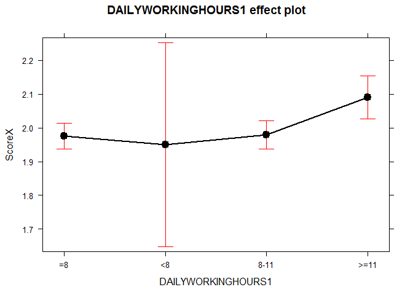

#### import data

    ## Warning: package 'MASS' was built under R version 3.2.4

    ## Warning: package 'effects' was built under R version 3.2.4

    ## Warning: package 'vcd' was built under R version 3.2.4

    ## Warning: package 'mlogit' was built under R version 3.2.4

    ## Warning: package 'maxLik' was built under R version 3.2.4

    ## Warning: package 'miscTools' was built under R version 3.2.4

    ## Warning: package 'nnet' was built under R version 3.2.4

    ## Warning: package 'data.table' was built under R version 3.2.4

#### Rename data as codebook provided (some discrepency and several missing attributes regarding physical health status)

#### Prepare data for statistical analysis

#### Chi-square Test for Socio-demographic characteristics of Rural-to-Urban Migrants by Gender

    ##       GenderX
    ## AgeX   Male Female
    ##   <=32 1237   1408
    ##   >32  1574   1265

    ## 
    ##  Pearson's Chi-squared test
    ## 
    ## data:  Age
    ## X-squared = 41.241, df = 1, p-value = 1.346e-10

    ##                     GenderX
    ## Occupation           Male Female
    ##   Manufacturing      1406   1107
    ##   Construction        677     92
    ##   Hospitality         148    237
    ##   Domestic service    144    430
    ##   Small business      232    403
    ##   Recreation/leisure  204    404

    ## 
    ##  Pearson's Chi-squared test
    ## 
    ## data:  Occupation
    ## X-squared = 752.52, df = 5, p-value < 2.2e-16

    ##               GenderX
    ## WorkplaceScale Male Female
    ##       Large     851    649
    ##       Moderate 1101    841
    ##       Small     859   1183

    ## 
    ##  Pearson's Chi-squared test
    ## 
    ## data:  WorkplaceScale
    ## X-squared = 110.02, df = 2, p-value < 2.2e-16

    ##                      GenderX
    ## EducationAttainmentX  Male Female
    ##   Elementary or lower   53    110
    ##   Junior high school   340    501
    ##   High school         1409   1380
    ##   College             1009    682

    ## 
    ##  Pearson's Chi-squared test
    ## 
    ## data:  EducationAttainment
    ## X-squared = 110.89, df = 3, p-value < 2.2e-16

    ##                      GenderX
    ## MaritalStatus         Male Female
    ##   Married             2042   1977
    ##   Single               700    631
    ##   Cohabitating          39     47
    ##   Divorced or widowed   30     18

    ## 
    ##  Pearson's Chi-squared test
    ## 
    ## data:  MaritalStatus
    ## X-squared = 4.9029, df = 3, p-value = 0.179

    ##                              GenderX
    ## AccompanyChildX               Male Female
    ##   No children                  849    796
    ##   Cohabitating children        878    968
    ##   Children residing elsewhere 1084    909

    ## 
    ##  Pearson's Chi-squared test
    ## 
    ## data:  AccompanyChild
    ## X-squared = 18, df = 2, p-value = 0.0001234

    ##               GenderX
    ## SalaryX        Male Female
    ##   <1500RMB      168    317
    ##   1500-2500RMB 1036   1492
    ##   2500-3500RMB 1071    628
    ##   >=3500RMB     536    236

    ## 
    ##  Pearson's Chi-squared test
    ## 
    ## data:  Salary
    ## X-squared = 356.87, df = 3, p-value < 2.2e-16

    ##                         GenderX
    ## NumberOfCitiesResidedInX Male Female
    ##                      1-2 1859   2207
    ##                      >=3  952    466

    ## 
    ##  Pearson's Chi-squared test
    ## 
    ## data:  NumberOfCitiesResidedIn
    ## X-squared = 193, df = 1, p-value < 2.2e-16

    ##                   GenderX
    ## DailyWorkingHoursX Male Female
    ##               =8   1273   1310
    ##               <8     18     62
    ##               8-11 1066    615
    ##               >=11  454    686

    ## 
    ##  Pearson's Chi-squared test
    ## 
    ## data:  DailyWorkingHours
    ## X-squared = 189.59, df = 3, p-value < 2.2e-16

    ##                   GenderX
    ## WeeklyWorkingDaysX Male Female
    ##                <=4   57     99
    ##                5    805    759
    ##                6   1046   1201
    ##                7    903    614

    ## 
    ##  Pearson's Chi-squared test
    ## 
    ## data:  WeeklyWorkingDays
    ## X-squared = 74.984, df = 3, p-value = 3.652e-16

    ##                        GenderX
    ## TypeOfResidence         Male Female
    ##   Collective dormitory  1040    515
    ##   Renting with others    324    312
    ##   Renting as a family    897   1400
    ##   Renting alone          430    324
    ##   Owning a living place  120    122

    ## 
    ##  Pearson's Chi-squared test
    ## 
    ## data:  TypeOfResidence
    ## X-squared = 299.26, df = 4, p-value < 2.2e-16

#### Chi-square Test for Physical and Mental Status and Lifestyle Behaviours of Rural-to-Urban Migrants by Gender

    ##                     GenderX
    ## BMIX                 Male Female
    ##   Under Weight        108    238
    ##   Normal             1785   1883
    ##   Overweight/Obesity  918    552

    ## 
    ##  Pearson's Chi-squared test
    ## 
    ## data:  BMI
    ## X-squared = 139.2, df = 2, p-value < 2.2e-16

    ##              GenderX
    ## MentalHealthX Male Female
    ##      Normal   2508   2378
    ##      Abnormal  303    295

    ## 
    ##  Pearson's Chi-squared test
    ## 
    ## data:  MentalHealth
    ## X-squared = 0.093297, df = 1, p-value = 0.76

    ##                               GenderX
    ## CurrentSmokerX                 Male Female
    ##   Previous smoker/Never smoked 1489   2611
    ##   Current smoker               1322     62

    ## 
    ##  Pearson's Chi-squared test
    ## 
    ## data:  Smoking
    ## X-squared = 1451.6, df = 1, p-value < 2.2e-16

    ##                           GenderX
    ## HazardousDrinkX            Male Female
    ##   Nonhazardous alcohol use 1980   2458
    ##   Hazardous alcohol use     831    215

    ## 
    ##  Pearson's Chi-squared test
    ## 
    ## data:  Drinking
    ## X-squared = 411.04, df = 1, p-value < 2.2e-16

    ##                       GenderX
    ## DailySleepingHoursX    Male Female
    ##   7-9 Hours/night      2165   2105
    ##   <7 or >9 Hours/night  646    568

    ## 
    ##  Pearson's Chi-squared test
    ## 
    ## data:  SleepingTime
    ## X-squared = 2.3835, df = 1, p-value = 0.1226

    ##                           GenderX
    ## SleepingQualityX           Male Female
    ##   Nonhazardous alcohol use 2474   2341
    ##   Hazardous alcohol use     337    332

    ## 
    ##  Pearson's Chi-squared test
    ## 
    ## data:  SleepingQuality
    ## X-squared = 0.2386, df = 1, p-value = 0.6252

    ##                             GenderX
    ## DailyBreakfastX              Male Female
    ##   Almost Daily Breakfast     2302   2156
    ##   Not Almost Daily Breakfast  509    517

    ## 
    ##  Pearson's Chi-squared test
    ## 
    ## data:  DailyBreakfast
    ## X-squared = 1.3721, df = 1, p-value = 0.2414

    ##                                     GenderX
    ## DailyFruitsVegetablesX               Male Female
    ##   Almost Daily Fruits Vegetables     2101   2149
    ##   Not Almost Daily Fruits Vegetables  710    524

    ## 
    ##  Pearson's Chi-squared test
    ## 
    ## data:  DailyFruitsVegetables
    ## X-squared = 25.121, df = 1, p-value = 5.384e-07

    ##                                  GenderX
    ## DailyRegularMealsX                Male Female
    ##   Almost Daily Regular Meals      2398   2244
    ##   Not Almost Daily Regular Meals   413    429

    ## 
    ##  Pearson's Chi-squared test
    ## 
    ## data:  DailyRegularMeals
    ## X-squared = 1.9416, df = 1, p-value = 0.1635

    ##                     GenderX
    ## ScoreX               Male Female
    ##   Healthy             905    704
    ##   Relatively Healthy  996    470
    ##   Unhealthy           910   1499

    ## 
    ##  Pearson's Chi-squared test
    ## 
    ## data:  LifestyleScoreX
    ## X-squared = 354.6, df = 2, p-value < 2.2e-16

#### Discuss the Association between lifestyle Score and socio-demographic characteristics and phiscal and mental status (By Gender)

#### 1. For Male rural-to-urban migrants

    ## 
    ## Call:
    ## glm(formula = ScoreX ~ AGE1 + OCCUPATION1 + WORKPLACESCALE1 + 
    ##     EDUCATIONATTAINMENT1 + MARITALSTATUS1 + ACCOMPANYCHILD1 + 
    ##     SALARY1 + NUMBEROFCITIESRESIDEDIN1 + DAILYWORKINGHOURS1 + 
    ##     WEEKLYWORKINGDAYS1 + RESIDENCE1 + BMI1 + MENTALHEALTH1, data = Male)
    ## 
    ## Deviance Residuals: 
    ##      Min        1Q    Median        3Q       Max  
    ## -1.38308  -0.90186   0.01585   0.89558   1.28287  
    ## 
    ## Coefficients:
    ##                                 Estimate Std. Error t value Pr(>|t|)    
    ## (Intercept)                     2.329382   0.193652  12.029  < 2e-16 ***
    ## AGE1>32                        -0.025388   0.036307  -0.699 0.484449    
    ## OCCUPATION1Construction        -0.088094   0.049035  -1.797 0.072515 .  
    ## OCCUPATION1Hospitality          0.151846   0.074218   2.046 0.040856 *  
    ## OCCUPATION1DomesticSservices    0.047332   0.072496   0.653 0.513879    
    ## OCCUPATION1SmallBusiness       -0.007795   0.061684  -0.126 0.899453    
    ## OCCUPATION1Recreation/Leisures  0.250505   0.066824   3.749 0.000181 ***
    ## WORKPLACESCALE1Moderate        -0.013771   0.039726  -0.347 0.728870    
    ## WORKPLACESCALE1Small            0.021370   0.044112   0.484 0.628108    
    ## EDUCATIONATTAINMENT1JuniorHigh -0.020628   0.118819  -0.174 0.862185    
    ## EDUCATIONATTAINMENT1HighSchool -0.061811   0.113081  -0.547 0.584696    
    ## EDUCATIONATTAINMENT1College    -0.074195   0.115660  -0.641 0.521255    
    ## MARITALSTATUS1Single           -0.035130   0.062505  -0.562 0.574130    
    ## MARITALSTATUS1Cohabitating     -0.170349   0.138568  -1.229 0.219044    
    ## MARITALSTATUS1Divorced/Widowed -0.032726   0.148017  -0.221 0.825034    
    ## ACCOMPANYCHILD1Cohabitate      -0.179272   0.063309  -2.832 0.004664 ** 
    ## ACCOMPANYCHILD1ResideElsewhere -0.100633   0.060962  -1.651 0.098903 .  
    ## SALARY11500-2500RMB             0.004232   0.067482   0.063 0.950005    
    ## SALARY12500-3500RMB             0.053060   0.067673   0.784 0.433072    
    ## SALARY1>=3500RMB                0.041013   0.073307   0.559 0.575885    
    ## NUMBEROFCITIESRESIDEDIN1>=3     0.045718   0.033250   1.375 0.169256    
    ## DAILYWORKINGHOURS1<8            0.111936   0.191750   0.584 0.559429    
    ## DAILYWORKINGHOURS18-11          0.005799   0.038354   0.151 0.879830    
    ## DAILYWORKINGHOURS1>=11         -0.026261   0.048934  -0.537 0.591544    
    ## WEEKLYWORKINGDAYS15            -0.125497   0.112377  -1.117 0.264198    
    ## WEEKLYWORKINGDAYS16            -0.198486   0.109990  -1.805 0.071247 .  
    ## WEEKLYWORKINGDAYS17            -0.143338   0.111490  -1.286 0.198672    
    ## RESIDENCE1Rent(with others)    -0.120623   0.053245  -2.265 0.023563 *  
    ## RESIDENCE1Rent(family)         -0.005876   0.043090  -0.136 0.891535    
    ## RESIDENCE1Rent(alone)          -0.081594   0.049040  -1.664 0.096257 .  
    ## RESIDENCE1OwnLivingPlace        0.059527   0.083574   0.712 0.476359    
    ## BMI1NormalWeight               -0.029018   0.080637  -0.360 0.718985    
    ## BMI1Overweight                 -0.013448   0.084069  -0.160 0.872921    
    ## MENTALHEALTH1Abnormal           0.053209   0.049516   1.075 0.282663    
    ## ---
    ## Signif. codes:  0 '***' 0.001 '**' 0.01 '*' 0.05 '.' 0.1 ' ' 1
    ## 
    ## (Dispersion parameter for gaussian family taken to be 0.6379417)
    ## 
    ##     Null deviance: 1815.0  on 2810  degrees of freedom
    ## Residual deviance: 1771.6  on 2777  degrees of freedom
    ## AIC: 6749.5
    ## 
    ## Number of Fisher Scoring iterations: 2

    ##                                       COR     2.5 %     97.5 %
    ## (Intercept)                    10.2715908 7.0275013 15.0132420
    ## AGE1>32                         0.9749318 0.9079666  1.0468358
    ## OCCUPATION1Construction         0.9156745 0.8317681  1.0080451
    ## OCCUPATION1Hospitality          1.1639815 1.0064016  1.3462349
    ## OCCUPATION1DomesticSservices    1.0484704 0.9095933  1.2085512
    ## OCCUPATION1SmallBusiness        0.9922357 0.8792438  1.1197481
    ## OCCUPATION1Recreation/Leisures  1.2846745 1.1269701  1.4644476
    ## WORKPLACESCALE1Moderate         0.9863229 0.9124405  1.0661878
    ## WORKPLACESCALE1Small            1.0215998 0.9369850  1.1138559
    ## EDUCATIONATTAINMENT1JuniorHigh  0.9795833 0.7760727  1.2364607
    ## EDUCATIONATTAINMENT1HighSchool  0.9400609 0.7531837  1.1733054
    ## EDUCATIONATTAINMENT1College     0.9284903 0.7401627  1.1647362
    ## MARITALSTATUS1Single            0.9654795 0.8541596  1.0913073
    ## MARITALSTATUS1Cohabitating      0.8433705 0.6427898  1.1065418
    ## MARITALSTATUS1Divorced/Widowed  0.9678038 0.7240941  1.2935394
    ## ACCOMPANYCHILD1Cohabitate       0.8358782 0.7383359  0.9463068
    ## ACCOMPANYCHILD1ResideElsewhere  0.9042651 0.8024258  1.0190292
    ## SALARY11500-2500RMB             1.0042405 0.8798264  1.1462478
    ## SALARY12500-3500RMB             1.0544929 0.9235066  1.2040578
    ## SALARY1>=3500RMB                1.0418658 0.9024284  1.2028482
    ## NUMBEROFCITIESRESIDEDIN1>=3     1.0467788 0.9807362  1.1172686
    ## DAILYWORKINGHOURS1<8            1.1184412 0.7680603  1.6286622
    ## DAILYWORKINGHOURS18-11          1.0058160 0.9329778  1.0843406
    ## DAILYWORKINGHOURS1>=11          0.9740806 0.8849971  1.0721311
    ## WEEKLYWORKINGDAYS15             0.8820582 0.7076876  1.0993929
    ## WEEKLYWORKINGDAYS16             0.8199710 0.6609600  1.0172361
    ## WEEKLYWORKINGDAYS17             0.8664615 0.6963835  1.0780777
    ## RESIDENCE1Rent(with others)     0.8863683 0.7985312  0.9838673
    ## RESIDENCE1Rent(family)          0.9941408 0.9136283  1.0817484
    ## RESIDENCE1Rent(alone)           0.9216458 0.8371849  1.0146276
    ## RESIDENCE1OwnLivingPlace        1.0613345 0.9009773  1.2502324
    ## BMI1NormalWeight                0.9713994 0.8293907  1.1377229
    ## BMI1Overweight                  0.9866420 0.8367578  1.1633742
    ## MENTALHEALTH1Abnormal           1.0546496 0.9571053  1.1621351

<!-- --><!-- --><!-- --><!-- -->

#### 2. For Female rural-to-urban migrants

    ## 
    ## Call:
    ## glm(formula = ScoreX ~ AGE2 + OCCUPATION2 + WORKPLACESCALE2 + 
    ##     EDUCATIONATTAINMENT2 + MARITALSTATUS2 + ACCOMPANYCHILD2 + 
    ##     SALARY2 + NUMBEROFCITIESRESIDEDIN2 + DAILYWORKINGHOURS2 + 
    ##     WEEKLYWORKINGDAYS2 + RESIDENCE2 + BMI2 + MENTALHEALTH2, data = Female)
    ## 
    ## Deviance Residuals: 
    ##     Min       1Q   Median       3Q      Max  
    ## -1.5872  -1.0727   0.5184   0.6910   1.1395  
    ## 
    ## Coefficients:
    ##                                 Estimate Std. Error t value Pr(>|t|)    
    ## (Intercept)                     2.673446   0.169647  15.759  < 2e-16 ***
    ## AGE2>32                        -0.050683   0.041375  -1.225 0.220695    
    ## OCCUPATION2Construction        -0.002605   0.102705  -0.025 0.979769    
    ## OCCUPATION2Hospitality         -0.090422   0.066190  -1.366 0.172027    
    ## OCCUPATION2DomesticSservices   -0.104643   0.055032  -1.901 0.057347 .  
    ## OCCUPATION2SmallBusiness       -0.182434   0.060711  -3.005 0.002681 ** 
    ## OCCUPATION2Recreation/Leisures -0.175978   0.064245  -2.739 0.006201 ** 
    ## WORKPLACESCALE2Moderate         0.017761   0.049547   0.358 0.720018    
    ## WORKPLACESCALE2Small            0.033477   0.048335   0.693 0.488621    
    ## EDUCATIONATTAINMENT2JuniorHigh -0.058507   0.091120  -0.642 0.520876    
    ## EDUCATIONATTAINMENT2HighSchool -0.026486   0.088551  -0.299 0.764884    
    ## EDUCATIONATTAINMENT2College     0.001797   0.094733   0.019 0.984864    
    ## MARITALSTATUS2Single           -0.045235   0.071611  -0.632 0.527657    
    ## MARITALSTATUS2Cohabitating      0.046891   0.139091   0.337 0.736050    
    ## MARITALSTATUS2Divorced/Widowed -0.002672   0.204303  -0.013 0.989567    
    ## ACCOMPANYCHILD2Cohabitate       0.023411   0.070589   0.332 0.740178    
    ## ACCOMPANYCHILD2ResideElsewhere  0.083579   0.068685   1.217 0.223774    
    ## SALARY21500-2500RMB             0.002714   0.054451   0.050 0.960249    
    ## SALARY22500-3500RMB             0.007799   0.061915   0.126 0.899776    
    ## SALARY2>=3500RMB                0.038494   0.081075   0.475 0.634971    
    ## NUMBEROFCITIESRESIDEDIN2>=3    -0.066186   0.044477  -1.488 0.136849    
    ## DAILYWORKINGHOURS2<8           -0.184766   0.113778  -1.624 0.104514    
    ## DAILYWORKINGHOURS28-11         -0.138720   0.045141  -3.073 0.002141 ** 
    ## DAILYWORKINGHOURS2>=11         -0.168158   0.047874  -3.513 0.000451 ***
    ## WEEKLYWORKINGDAYS25            -0.281671   0.100109  -2.814 0.004934 ** 
    ## WEEKLYWORKINGDAYS26            -0.198405   0.095766  -2.072 0.038384 *  
    ## WEEKLYWORKINGDAYS27            -0.172441   0.095651  -1.803 0.071530 .  
    ## RESIDENCE2Rent(with others)     0.004328   0.066629   0.065 0.948215    
    ## RESIDENCE2Rent(family)          0.040073   0.051217   0.782 0.434047    
    ## RESIDENCE2Rent(alone)          -0.029496   0.064036  -0.461 0.645107    
    ## RESIDENCE2OwnLivingPlace        0.098005   0.094923   1.032 0.301946    
    ## BMI2NormalWeight               -0.015997   0.060717  -0.263 0.792208    
    ## BMI2Overweight                  0.003406   0.071425   0.048 0.961966    
    ## MENTALHEALTH2Abnormal          -0.137627   0.053695  -2.563 0.010429 *  
    ## ---
    ## Signif. codes:  0 '***' 0.001 '**' 0.01 '*' 0.05 '.' 0.1 ' ' 1
    ## 
    ## (Dispersion parameter for gaussian family taken to be 0.7273766)
    ## 
    ##     Null deviance: 1966.6  on 2672  degrees of freedom
    ## Residual deviance: 1919.5  on 2639  degrees of freedom
    ## AIC: 6770.6
    ## 
    ## Number of Fisher Scoring iterations: 2

    ##                                       COR      2.5 %     97.5 %
    ## (Intercept)                    14.4898218 10.3910429 20.2053766
    ## AGE2>32                         0.9505800  0.8765375  1.0308771
    ## OCCUPATION2Construction         0.9973987  0.8155418  1.2198078
    ## OCCUPATION2Hospitality          0.9135457  0.8023965  1.0400914
    ## OCCUPATION2DomesticSservices    0.9006459  0.8085569  1.0032233
    ## OCCUPATION2SmallBusiness        0.8332393  0.7397630  0.9385274
    ## OCCUPATION2Recreation/Leisures  0.8386364  0.7394154  0.9511718
    ## WORKPLACESCALE2Moderate         1.0179201  0.9237170  1.1217303
    ## WORKPLACESCALE2Small            1.0340432  0.9405811  1.1367922
    ## EDUCATIONATTAINMENT2JuniorHigh  0.9431721  0.7889135  1.1275934
    ## EDUCATIONATTAINMENT2HighSchool  0.9738617  0.8186956  1.1584362
    ## EDUCATIONATTAINMENT2College     1.0017990  0.8320395  1.2061941
    ## MARITALSTATUS2Single            0.9557733  0.8306147  1.0997911
    ## MARITALSTATUS2Cohabitating      1.0480077  0.7979396  1.3764451
    ## MARITALSTATUS2Divorced/Widowed  0.9973317  0.6682461  1.4884795
    ## ACCOMPANYCHILD2Cohabitate       1.0236873  0.8914186  1.1755820
    ## ACCOMPANYCHILD2ResideElsewhere  1.0871711  0.9502391  1.2438354
    ## SALARY21500-2500RMB             1.0027179  0.9012178  1.1156494
    ## SALARY22500-3500RMB             1.0078291  0.8926574  1.1378604
    ## SALARY2>=3500RMB                1.0392445  0.8865574  1.2182280
    ## NUMBEROFCITIESRESIDEDIN2>=3     0.9359569  0.8578210  1.0212099
    ## DAILYWORKINGHOURS2<8            0.8312991  0.6651343  1.0389755
    ## DAILYWORKINGHOURS28-11          0.8704721  0.7967662  0.9509962
    ## DAILYWORKINGHOURS2>=11          0.8452205  0.7695200  0.9283679
    ## WEEKLYWORKINGDAYS25             0.7545220  0.6200966  0.9180883
    ## WEEKLYWORKINGDAYS26             0.8200373  0.6797001  0.9893497
    ## WEEKLYWORKINGDAYS27             0.8416078  0.6977372  1.0151440
    ## RESIDENCE2Rent(with others)     1.0043373  0.8813837  1.1444430
    ## RESIDENCE2Rent(family)          1.0408865  0.9414711  1.1507997
    ## RESIDENCE2Rent(alone)           0.9709343  0.8564110  1.1007721
    ## RESIDENCE2OwnLivingPlace        1.1029684  0.9157239  1.3285002
    ## BMI2NormalWeight                0.9841301  0.8737152  1.1084985
    ## BMI2Overweight                  1.0034122  0.8723325  1.1541883
    ## MENTALHEALTH2Abnormal           0.8714239  0.7843751  0.9681332

<!-- --><!-- --><!-- --><!-- --><!-- --><!-- -->
