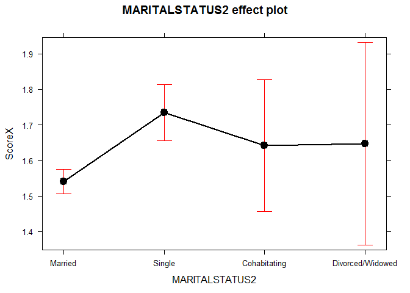
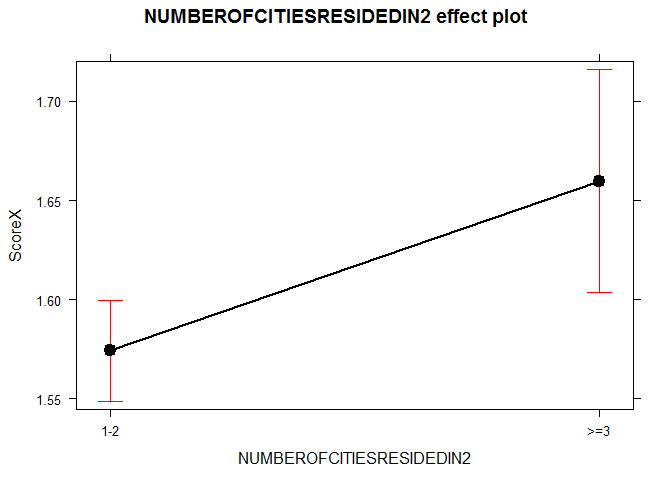
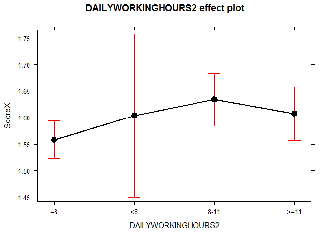
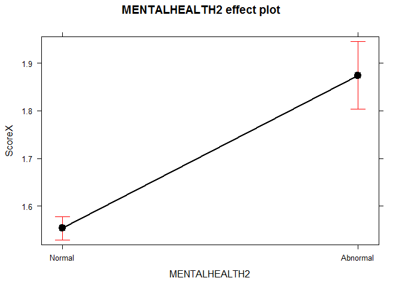

#### import data

    ## Warning: package 'MASS' was built under R version 3.2.4

    ## Warning: package 'effects' was built under R version 3.2.4

    ## Warning: package 'vcd' was built under R version 3.2.4

    ## Warning: package 'mlogit' was built under R version 3.2.4

    ## Warning: package 'maxLik' was built under R version 3.2.4

    ## Warning: package 'miscTools' was built under R version 3.2.4

    ## Warning: package 'nnet' was built under R version 3.2.4

    ## Warning: package 'data.table' was built under R version 3.2.4

#### Rename data as codebook provided (some discrepency and several missing attributes regarding physical health status)

#### Prepare data for statistical analysis

#### Chi-square Test for Socio-demographic characteristics of Rural-to-Urban Migrants by Gender

    ##       GenderX
    ## AgeX   Male Female
    ##   <=32 1237   1408
    ##   >32  1574   1265

    ## 
    ##  Pearson's Chi-squared test
    ## 
    ## data:  Age
    ## X-squared = 41.241, df = 1, p-value = 1.346e-10

    ##                     GenderX
    ## Occupation           Male Female
    ##   Manufacturing      1406   1107
    ##   Construction        677     92
    ##   Hospitality         148    237
    ##   Domestic service    144    430
    ##   Small business      232    403
    ##   Recreation/leisure  204    404

    ## 
    ##  Pearson's Chi-squared test
    ## 
    ## data:  Occupation
    ## X-squared = 752.52, df = 5, p-value < 2.2e-16

    ##               GenderX
    ## WorkplaceScale Male Female
    ##       Large     851    649
    ##       Moderate 1101    841
    ##       Small     859   1183

    ## 
    ##  Pearson's Chi-squared test
    ## 
    ## data:  WorkplaceScale
    ## X-squared = 110.02, df = 2, p-value < 2.2e-16

    ##                      GenderX
    ## EducationAttainmentX  Male Female
    ##   Elementary or lower   53    110
    ##   Junior high school   340    501
    ##   High school         1409   1380
    ##   College             1009    682

    ## 
    ##  Pearson's Chi-squared test
    ## 
    ## data:  EducationAttainment
    ## X-squared = 110.89, df = 3, p-value < 2.2e-16

    ##                      GenderX
    ## MaritalStatus         Male Female
    ##   Married             2042   1977
    ##   Single               700    631
    ##   Cohabitating          39     47
    ##   Divorced or widowed   30     18

    ## 
    ##  Pearson's Chi-squared test
    ## 
    ## data:  MaritalStatus
    ## X-squared = 4.9029, df = 3, p-value = 0.179

    ##                              GenderX
    ## AccompanyChildX               Male Female
    ##   No children                  849    796
    ##   Cohabitating children        878    968
    ##   Children residing elsewhere 1084    909

    ## 
    ##  Pearson's Chi-squared test
    ## 
    ## data:  AccompanyChild
    ## X-squared = 18, df = 2, p-value = 0.0001234

    ##               GenderX
    ## SalaryX        Male Female
    ##   <1500RMB      168    317
    ##   1500-2500RMB 1036   1492
    ##   2500-3500RMB 1071    628
    ##   >=3500RMB     536    236

    ## 
    ##  Pearson's Chi-squared test
    ## 
    ## data:  Salary
    ## X-squared = 356.87, df = 3, p-value < 2.2e-16

    ##                         GenderX
    ## NumberOfCitiesResidedInX Male Female
    ##                      1-2 1859   2207
    ##                      >=3  952    466

    ## 
    ##  Pearson's Chi-squared test
    ## 
    ## data:  NumberOfCitiesResidedIn
    ## X-squared = 193, df = 1, p-value < 2.2e-16

    ##                   GenderX
    ## DailyWorkingHoursX Male Female
    ##               =8   1273   1310
    ##               <8     18     62
    ##               8-11 1066    615
    ##               >=11  454    686

    ## 
    ##  Pearson's Chi-squared test
    ## 
    ## data:  DailyWorkingHours
    ## X-squared = 189.59, df = 3, p-value < 2.2e-16

    ##                   GenderX
    ## WeeklyWorkingDaysX Male Female
    ##                <=4   57     99
    ##                5    805    759
    ##                6   1046   1201
    ##                7    903    614

    ## 
    ##  Pearson's Chi-squared test
    ## 
    ## data:  WeeklyWorkingDays
    ## X-squared = 74.984, df = 3, p-value = 3.652e-16

    ##                        GenderX
    ## TypeOfResidence         Male Female
    ##   Collective dormitory  1040    515
    ##   Renting with others    324    312
    ##   Renting as a family    897   1400
    ##   Renting alone          430    324
    ##   Owning a living place  120    122

    ## 
    ##  Pearson's Chi-squared test
    ## 
    ## data:  TypeOfResidence
    ## X-squared = 299.26, df = 4, p-value < 2.2e-16

#### Chi-square Test for Physical and Mental Status and Lifestyle Behaviours of Rural-to-Urban Migrants by Gender

    ##                     GenderX
    ## BMIX                 Male Female
    ##   Under Weight        108    238
    ##   Normal             1785   1883
    ##   Overweight/Obesity  918    552

    ## 
    ##  Pearson's Chi-squared test
    ## 
    ## data:  BMI
    ## X-squared = 139.2, df = 2, p-value < 2.2e-16

    ##              GenderX
    ## MentalHealthX Male Female
    ##      Normal   2508   2378
    ##      Abnormal  303    295

    ## 
    ##  Pearson's Chi-squared test
    ## 
    ## data:  MentalHealth
    ## X-squared = 0.093297, df = 1, p-value = 0.76

    ##                               GenderX
    ## CurrentSmokerX                 Male Female
    ##   Previous smoker/Never smoked 1489   2611
    ##   Current smoker               1322     62

    ## 
    ##  Pearson's Chi-squared test
    ## 
    ## data:  Smoking
    ## X-squared = 1451.6, df = 1, p-value < 2.2e-16

    ##                           GenderX
    ## HazardousDrinkX            Male Female
    ##   Nonhazardous alcohol use 1980   2458
    ##   Hazardous alcohol use     831    215

    ## 
    ##  Pearson's Chi-squared test
    ## 
    ## data:  Drinking
    ## X-squared = 411.04, df = 1, p-value < 2.2e-16

    ##                       GenderX
    ## DailySleepingHoursX    Male Female
    ##   7-9 Hours/night      2165   2105
    ##   <7 or >9 Hours/night  646    568

    ## 
    ##  Pearson's Chi-squared test
    ## 
    ## data:  SleepingTime
    ## X-squared = 2.3835, df = 1, p-value = 0.1226

    ##                           GenderX
    ## SleepingQualityX           Male Female
    ##   Nonhazardous alcohol use 2474   2341
    ##   Hazardous alcohol use     337    332

    ## 
    ##  Pearson's Chi-squared test
    ## 
    ## data:  SleepingQuality
    ## X-squared = 0.2386, df = 1, p-value = 0.6252

    ##                             GenderX
    ## DailyBreakfastX              Male Female
    ##   Almost Daily Breakfast     2302   2156
    ##   Not Almost Daily Breakfast  509    517

    ## 
    ##  Pearson's Chi-squared test
    ## 
    ## data:  DailyBreakfast
    ## X-squared = 1.3721, df = 1, p-value = 0.2414

    ##                                     GenderX
    ## DailyFruitsVegetablesX               Male Female
    ##   Almost Daily Fruits Vegetables     2101   2149
    ##   Not Almost Daily Fruits Vegetables  710    524

    ## 
    ##  Pearson's Chi-squared test
    ## 
    ## data:  DailyFruitsVegetables
    ## X-squared = 25.121, df = 1, p-value = 5.384e-07

    ##                                  GenderX
    ## DailyRegularMealsX                Male Female
    ##   Almost Daily Regular Meals      2398   2244
    ##   Not Almost Daily Regular Meals   413    429

    ## 
    ##  Pearson's Chi-squared test
    ## 
    ## data:  DailyRegularMeals
    ## X-squared = 1.9416, df = 1, p-value = 0.1635

    ##                     GenderX
    ## ScoreX               Male Female
    ##   Healthy             640   1385
    ##   Relatively Healthy 1544   1001
    ##   Unhealthy           627    287

    ## 
    ##  Pearson's Chi-squared test
    ## 
    ## data:  LifestyleScoreX
    ## X-squared = 513.27, df = 2, p-value < 2.2e-16

#### Discuss the Association between lifestyle Score and socio-demographic characteristics and phiscal and mental status (By Gender)

#### 1. For Male rural-to-urban migrants

    ## 
    ## Call:
    ## glm(formula = ScoreX ~ AGE1 + OCCUPATION1 + WORKPLACESCALE1 + 
    ##     EDUCATIONATTAINMENT1 + MARITALSTATUS1 + ACCOMPANYCHILD1 + 
    ##     SALARY1 + NUMBEROFCITIESRESIDEDIN1 + DAILYWORKINGHOURS1 + 
    ##     WEEKLYWORKINGDAYS1 + RESIDENCE1 + BMI1 + MENTALHEALTH1, data = Male)
    ## 
    ## Deviance Residuals: 
    ##      Min        1Q    Median        3Q       Max  
    ## -1.49797  -0.35625   0.05648   0.25285   1.32332  
    ## 
    ## Coefficients:
    ##                                 Estimate Std. Error t value Pr(>|t|)    
    ## (Intercept)                     1.978631   0.156230  12.665  < 2e-16 ***
    ## AGE1>32                         0.081273   0.029291   2.775  0.00556 ** 
    ## OCCUPATION1Construction         0.063100   0.039560   1.595  0.11081    
    ## OCCUPATION1Hospitality          0.154353   0.059876   2.578  0.00999 ** 
    ## OCCUPATION1DomesticSservices   -0.044610   0.058487  -0.763  0.44568    
    ## OCCUPATION1SmallBusiness        0.075734   0.049764   1.522  0.12816    
    ## OCCUPATION1Recreation/Leisures  0.331250   0.053911   6.144 9.18e-10 ***
    ## WORKPLACESCALE1Moderate        -0.008106   0.032049  -0.253  0.80034    
    ## WORKPLACESCALE1Small            0.115419   0.035588   3.243  0.00120 ** 
    ## EDUCATIONATTAINMENT1JuniorHigh -0.187499   0.095858  -1.956  0.05056 .  
    ## EDUCATIONATTAINMENT1HighSchool -0.111268   0.091229  -1.220  0.22270    
    ## EDUCATIONATTAINMENT1College    -0.072839   0.093310  -0.781  0.43509    
    ## MARITALSTATUS1Single            0.056723   0.050426   1.125  0.26074    
    ## MARITALSTATUS1Cohabitating      0.120444   0.111791   1.077  0.28140    
    ## MARITALSTATUS1Divorced/Widowed  0.100772   0.119414   0.844  0.39880    
    ## ACCOMPANYCHILD1Cohabitate      -0.008547   0.051075  -0.167  0.86712    
    ## ACCOMPANYCHILD1ResideElsewhere  0.007660   0.049181   0.156  0.87624    
    ## SALARY11500-2500RMB             0.027921   0.054442   0.513  0.60809    
    ## SALARY12500-3500RMB             0.058638   0.054596   1.074  0.28290    
    ## SALARY1>=3500RMB                0.117109   0.059141   1.980  0.04778 *  
    ## NUMBEROFCITIESRESIDEDIN1>=3    -0.004453   0.026825  -0.166  0.86817    
    ## DAILYWORKINGHOURS1<8           -0.025527   0.154696  -0.165  0.86894    
    ## DAILYWORKINGHOURS18-11          0.003987   0.030943   0.129  0.89748    
    ## DAILYWORKINGHOURS1>=11          0.114165   0.039478   2.892  0.00386 ** 
    ## WEEKLYWORKINGDAYS15            -0.163331   0.090661  -1.802  0.07172 .  
    ## WEEKLYWORKINGDAYS16            -0.048697   0.088735  -0.549  0.58320    
    ## WEEKLYWORKINGDAYS17            -0.115942   0.089946  -1.289  0.19750    
    ## RESIDENCE1Rent(with others)     0.006436   0.042956   0.150  0.88091    
    ## RESIDENCE1Rent(family)          0.023618   0.034763   0.679  0.49695    
    ## RESIDENCE1Rent(alone)           0.095617   0.039563   2.417  0.01572 *  
    ## RESIDENCE1OwnLivingPlace       -0.096656   0.067424  -1.434  0.15181    
    ## BMI1NormalWeight               -0.049859   0.065055  -0.766  0.44350    
    ## BMI1Overweight                 -0.066137   0.067823  -0.975  0.32958    
    ## MENTALHEALTH1Abnormal           0.358392   0.039948   8.972  < 2e-16 ***
    ## ---
    ## Signif. codes:  0 '***' 0.001 '**' 0.01 '*' 0.05 '.' 0.1 ' ' 1
    ## 
    ## (Dispersion parameter for gaussian family taken to be 0.4152092)
    ## 
    ##     Null deviance: 1266.9  on 2810  degrees of freedom
    ## Residual deviance: 1153.0  on 2777  degrees of freedom
    ## AIC: 5542.3
    ## 
    ## Number of Fisher Scoring iterations: 2

    ##                                      COR     2.5 %   97.5 %
    ## (Intercept)                    7.2328332 5.3250680 9.824077
    ## AGE1>32                        1.0846672 1.0241515 1.148759
    ## OCCUPATION1Construction        1.0651334 0.9856685 1.151005
    ## OCCUPATION1Hospitality         1.1669024 1.0376905 1.312204
    ## OCCUPATION1DomesticSservices   0.9563699 0.8527894 1.072531
    ## OCCUPATION1SmallBusiness       1.0786757 0.9784343 1.189187
    ## OCCUPATION1Recreation/Leisures 1.3927085 1.2530583 1.547922
    ## WORKPLACESCALE1Moderate        0.9919265 0.9315353 1.056233
    ## WORKPLACESCALE1Small           1.1223432 1.0467270 1.203422
    ## EDUCATIONATTAINMENT1JuniorHigh 0.8290299 0.6870298 1.000380
    ## EDUCATIONATTAINMENT1HighSchool 0.8946991 0.7482083 1.069871
    ## EDUCATIONATTAINMENT1College    0.9297503 0.7743564 1.116328
    ## MARITALSTATUS1Single           1.0583623 0.9587638 1.168307
    ## MARITALSTATUS1Cohabitating     1.1279970 0.9060484 1.404315
    ## MARITALSTATUS1Divorced/Widowed 1.1060244 0.8752245 1.397687
    ## ACCOMPANYCHILD1Cohabitate      0.9914896 0.8970421 1.095881
    ## ACCOMPANYCHILD1ResideElsewhere 1.0076896 0.9150892 1.109660
    ## SALARY11500-2500RMB            1.0283146 0.9242410 1.144107
    ## SALARY12500-3500RMB            1.0603913 0.9527829 1.180153
    ## SALARY1>=3500RMB               1.1242418 1.0011954 1.262411
    ## NUMBEROFCITIESRESIDEDIN1>=3    0.9955571 0.9445671 1.049300
    ## DAILYWORKINGHOURS1<8           0.9747957 0.7198406 1.320051
    ## DAILYWORKINGHOURS18-11         1.0039951 0.9449160 1.066768
    ## DAILYWORKINGHOURS1>=11         1.1209372 1.0374744 1.211114
    ## WEEKLYWORKINGDAYS15            0.8493102 0.7110422 1.014465
    ## WEEKLYWORKINGDAYS16            0.9524701 0.8004239 1.133398
    ## WEEKLYWORKINGDAYS17            0.8905267 0.7465949 1.062206
    ## RESIDENCE1Rent(with others)    1.0064568 0.9251902 1.094862
    ## RESIDENCE1Rent(family)         1.0238990 0.9564595 1.096094
    ## RESIDENCE1Rent(alone)          1.1003380 1.0182394 1.189056
    ## RESIDENCE1OwnLivingPlace       0.9078685 0.7954840 1.036130
    ## BMI1NormalWeight               0.9513637 0.8374750 1.080740
    ## BMI1Overweight                 0.9360028 0.8194939 1.069076
    ## MENTALHEALTH1Abnormal          1.4310271 1.3232573 1.547574

<!-- --><!-- --><!-- --><!-- --><!-- -->

#### 2. For Female rural-to-urban migrants

    ## 
    ## Call:
    ## glm(formula = ScoreX ~ AGE2 + OCCUPATION2 + WORKPLACESCALE2 + 
    ##     EDUCATIONATTAINMENT2 + MARITALSTATUS2 + ACCOMPANYCHILD2 + 
    ##     SALARY2 + NUMBEROFCITIESRESIDEDIN2 + DAILYWORKINGHOURS2 + 
    ##     WEEKLYWORKINGDAYS2 + RESIDENCE2 + BMI2 + MENTALHEALTH2, data = Female)
    ## 
    ## Deviance Residuals: 
    ##     Min       1Q   Median       3Q      Max  
    ## -1.6138  -0.4594  -0.2414   0.5136   1.7972  
    ## 
    ## Coefficients:
    ##                                 Estimate Std. Error t value Pr(>|t|)    
    ## (Intercept)                     1.293523   0.120644  10.722  < 2e-16 ***
    ## AGE2>32                         0.014917   0.029424   0.507 0.612224    
    ## OCCUPATION2Construction        -0.021491   0.073038  -0.294 0.768600    
    ## OCCUPATION2Hospitality          0.147091   0.047071   3.125 0.001798 ** 
    ## OCCUPATION2DomesticSservices    0.108534   0.039136   2.773 0.005589 ** 
    ## OCCUPATION2SmallBusiness        0.098447   0.043174   2.280 0.022675 *  
    ## OCCUPATION2Recreation/Leisures  0.517682   0.045688  11.331  < 2e-16 ***
    ## WORKPLACESCALE2Moderate         0.010667   0.035235   0.303 0.762112    
    ## WORKPLACESCALE2Small            0.051326   0.034373   1.493 0.135499    
    ## EDUCATIONATTAINMENT2JuniorHigh  0.039865   0.064800   0.615 0.538470    
    ## EDUCATIONATTAINMENT2HighSchool  0.020335   0.062973   0.323 0.746785    
    ## EDUCATIONATTAINMENT2College     0.018209   0.067369   0.270 0.786959    
    ## MARITALSTATUS2Single            0.193591   0.050926   3.801 0.000147 ***
    ## MARITALSTATUS2Cohabitating      0.100922   0.098914   1.020 0.307682    
    ## MARITALSTATUS2Divorced/Widowed  0.106013   0.145290   0.730 0.465661    
    ## ACCOMPANYCHILD2Cohabitate      -0.012255   0.050199  -0.244 0.807148    
    ## ACCOMPANYCHILD2ResideElsewhere -0.035067   0.048845  -0.718 0.472871    
    ## SALARY21500-2500RMB            -0.084068   0.038723  -2.171 0.030019 *  
    ## SALARY22500-3500RMB            -0.072600   0.044031  -1.649 0.099298 .  
    ## SALARY2>=3500RMB                0.143917   0.057656   2.496 0.012616 *  
    ## NUMBEROFCITIESRESIDEDIN2>=3     0.085318   0.031630   2.697 0.007033 ** 
    ## DAILYWORKINGHOURS2<8            0.045368   0.080913   0.561 0.575049    
    ## DAILYWORKINGHOURS28-11          0.075581   0.032102   2.354 0.018625 *  
    ## DAILYWORKINGHOURS2>=11          0.049497   0.034045   1.454 0.146106    
    ## WEEKLYWORKINGDAYS25            -0.032612   0.071192  -0.458 0.646931    
    ## WEEKLYWORKINGDAYS26             0.004615   0.068104   0.068 0.945979    
    ## WEEKLYWORKINGDAYS27             0.042469   0.068022   0.624 0.532455    
    ## RESIDENCE2Rent(with others)     0.070459   0.047383   1.487 0.137129    
    ## RESIDENCE2Rent(family)         -0.012636   0.036423  -0.347 0.728682    
    ## RESIDENCE2Rent(alone)           0.097644   0.045539   2.144 0.032110 *  
    ## RESIDENCE2OwnLivingPlace       -0.114915   0.067504  -1.702 0.088810 .  
    ## BMI2NormalWeight                0.053338   0.043179   1.235 0.216841    
    ## BMI2Overweight                  0.033017   0.050794   0.650 0.515736    
    ## MENTALHEALTH2Abnormal           0.320589   0.038185   8.396  < 2e-16 ***
    ## ---
    ## Signif. codes:  0 '***' 0.001 '**' 0.01 '*' 0.05 '.' 0.1 ' ' 1
    ## 
    ## (Dispersion parameter for gaussian family taken to be 0.367857)
    ## 
    ##     Null deviance: 1220.97  on 2672  degrees of freedom
    ## Residual deviance:  970.77  on 2639  degrees of freedom
    ## AIC: 4948.3
    ## 
    ## Number of Fisher Scoring iterations: 2

    ##                                      COR     2.5 %    97.5 %
    ## (Intercept)                    3.6456074 2.8779112 4.6180902
    ## AGE2>32                        1.0150284 0.9581486 1.0752849
    ## OCCUPATION2Construction        0.9787387 0.8481963 1.1293723
    ## OCCUPATION2Hospitality         1.1584592 1.0563645 1.2704211
    ## OCCUPATION2DomesticSservices   1.1146430 1.0323409 1.2035065
    ## OCCUPATION2SmallBusiness       1.1034555 1.0139224 1.2008948
    ## OCCUPATION2Recreation/Leisures 1.6781331 1.5343948 1.8353364
    ## WORKPLACESCALE2Moderate        1.0107243 0.9432791 1.0829919
    ## WORKPLACESCALE2Small           1.0526665 0.9840847 1.1260279
    ## EDUCATIONATTAINMENT2JuniorHigh 1.0406707 0.9165488 1.1816016
    ## EDUCATIONATTAINMENT2HighSchool 1.0205431 0.9020460 1.1546064
    ## EDUCATIONATTAINMENT2College    1.0183759 0.8924082 1.1621245
    ## MARITALSTATUS2Single           1.2135993 1.0983154 1.3409839
    ## MARITALSTATUS2Cohabitating     1.1061900 0.9112421 1.3428443
    ## MARITALSTATUS2Divorced/Widowed 1.1118359 0.8363149 1.4781265
    ## ACCOMPANYCHILD2Cohabitate      0.9878195 0.8952573 1.0899520
    ## ACCOMPANYCHILD2ResideElsewhere 0.9655407 0.8773913 1.0625463
    ## SALARY21500-2500RMB            0.9193689 0.8521751 0.9918609
    ## SALARY22500-3500RMB            0.9299730 0.8530831 1.0137930
    ## SALARY2>=3500RMB               1.1547884 1.0313961 1.2929429
    ## NUMBEROFCITIESRESIDEDIN2>=3    1.0890634 1.0235987 1.1587150
    ## DAILYWORKINGHOURS2<8           1.0464129 0.8929556 1.2262423
    ## DAILYWORKINGHOURS28-11         1.0785105 1.0127431 1.1485488
    ## DAILYWORKINGHOURS2>=11         1.0507422 0.9829170 1.1232476
    ## WEEKLYWORKINGDAYS25            0.9679142 0.8418567 1.1128473
    ## WEEKLYWORKINGDAYS26            1.0046257 0.8790917 1.1480859
    ## WEEKLYWORKINGDAYS27            1.0433837 0.9131537 1.1921865
    ## RESIDENCE2Rent(with others)    1.0730011 0.9778398 1.1774232
    ## RESIDENCE2Rent(family)         0.9874437 0.9194093 1.0605125
    ## RESIDENCE2Rent(alone)          1.1025700 1.0084241 1.2055053
    ## RESIDENCE2OwnLivingPlace       0.8914418 0.7809681 1.0175428
    ## BMI2NormalWeight               1.0547857 0.9691929 1.1479374
    ## BMI2Overweight                 1.0335682 0.9356281 1.1417604
    ## MENTALHEALTH2Abnormal          1.3779398 1.2785766 1.4850249

<!-- --><!-- --><!-- --><!-- --><!-- --><!-- -->
